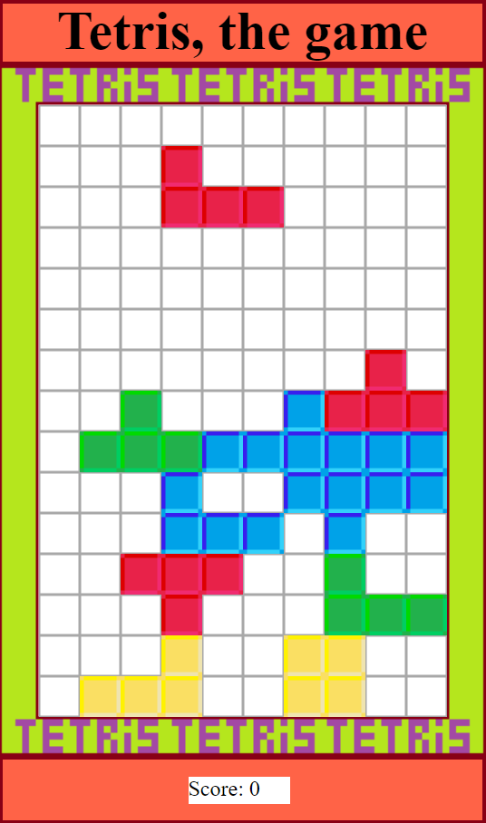

# About
tetris game with html, js and css

Made as university project, 2020

# How to play

Launch game:
- Download folder 'Tetris'
- Open this folder
- Open 'tetris.html' in any browser

In-game control:
- Press button 'Start game!' to begin game
- Use left/right arrows to move figure
- Use down arrow to speedup figure falling
- After fail and seeing score press button 'Start game!' again to play once more
